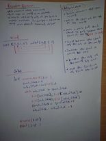

# Array Reverse
## Feature Tasks
* Write a function called reverseArray which takes an array as an argument. Without utilizing any of the built-in methods available to your language, return an array with elements in reversed order.

## Implemntation
define a functions that take a an array and define the start and then of the array , make a while loop the make sure the end of the array grater then start of the array , swap the start with end , call the function and print the list.

##Whiteboard

