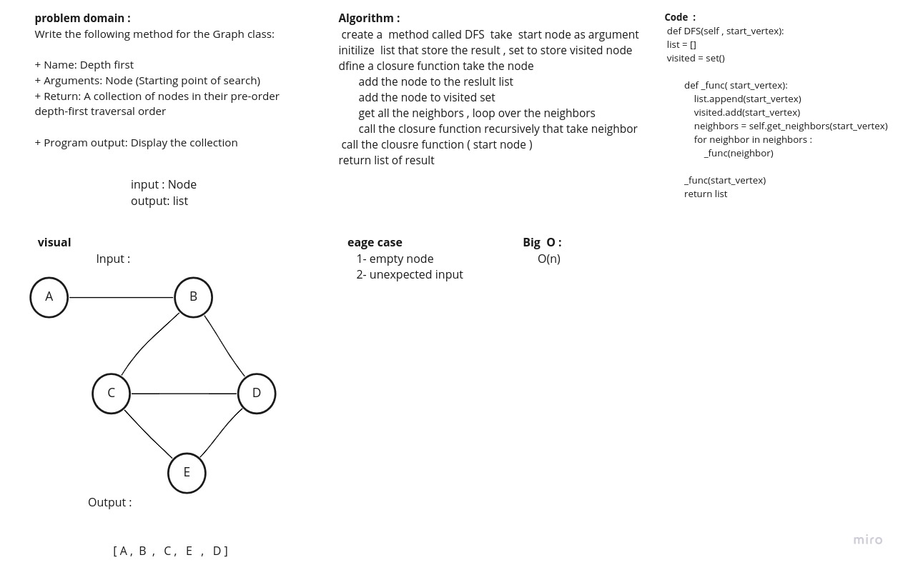

# Depth First Traversal
Depth First Search (DFS) algorithm traverses a graph in a depthward motion and uses a stack to remember to get the next vertex to start a search, when a dead end occurs in any iteration.

## Challenge
Write the following method for the Graph class:

+ Name: Depth first
+ Arguments: Node (Starting point of search)
+ Return: A collection of nodes in their pre-order depth-first traversal order

+ Program output: Display the collection

## Approach & Efficiency
O(n)
## Solution

