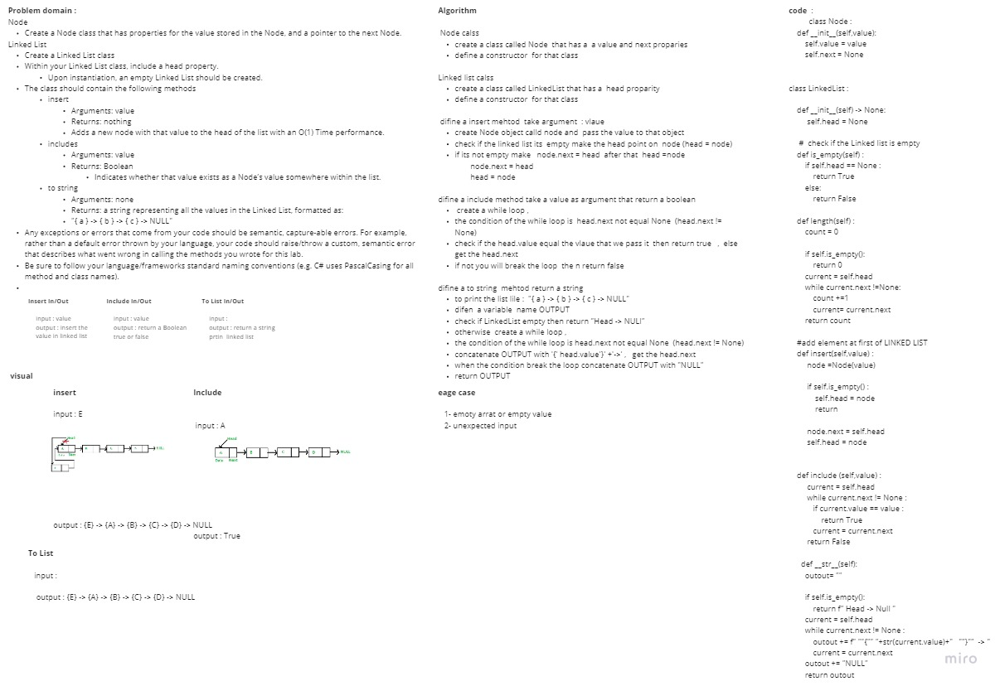

# Singly Linked List
Singly linked lists — Singly linked lists contain nodes which have a data field as well as 'next' field, which points to the next node in line of nodes.

## Challenge
### Features

#### Node
Create a Node class that has properties for the value stored in the Node, and a pointer to the next Node.
#### Linked List
+ Create a Linked List class

+ Within your Linked List class, include a head property.
    + Upon instantiation, an empty Linked List should be created.

+ The class should contain the following methods
   + insert
        + Arguments: value
        + Returns: nothing
        + Adds a new node with that value to the **head** of the list with an O(1) Time performance.
+ includes
   + Arguments: value
   + Returns: Boolean
        + Indicates whether that value exists as a Node’s value somewhere within the list.
+ to string
   + Arguments: none
  + Returns: a string representing all the values in the Linked List, formatted as:  "{ a } -> { b } -> { c } -> NULL"
+ Any exceptions or errors that come from your code should be semantic, capture-able errors. For example, rather than a default error thrown by your language, your code should raise/throw a custom, semantic error that describes what went wrong in calling the methods you wrote for this lab.

+ Be sure to follow your language/frameworks standard naming conventions (e.g. C# uses PascalCasing for all method and class names).

# whiteBoard

## Approach & Efficiency
<!-- What approach did you take? Why? What is the Big O space/time for this approach? -->

## API
<!-- Description of each method publicly available to your Linked List -->
