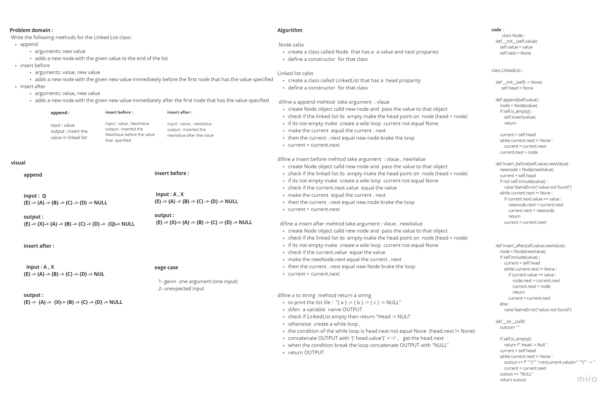

 ## Challenge
### Features
Write the following methods for the Linked List class:

 append
+ arguments: new value
adds a new node with the given value to the end of the list

+ insert before
+ arguments: value, new value
adds a new node with the given new value immediately before the first node that has the value specified

insert after
+ arguments: value, new value
+ adds a new node with the given new value immediately after the first node that has the value specified

insert before
+ arguments: value, new value
+ adds a new node with the given new value immediately before the first node that has the value specified

# whiteBoard

## Approach & Efficiency
<!-- What approach did you take? Why? What is the Big O space/time for this approach? -->
### append
+ Big O(n)

### insert before
+ Big O(n)

### insert after
+ Big O(n)

## API
<!-- Description of each method publicly available to your Linked List -->
